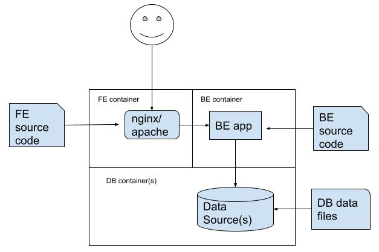

# docker-compose-development
A challenge for getting comfortable with developing locally using docker-compose

# The Goal

The goal of this exercise is simple: write a docker-compose.yml file that exposes the front-end of a front-end/back-end application with a backing data store.

Fork this repo and add code for a front-end/back-end application of your choice. The only requirements are these:
* The application should have static assets (served from disk) as well as dynamic routes (served by the back-end app)
* The back-end application should have a backing data store such as MySQL, PostgreSQL, MongoDB, Redis, etc.

# Implementing docker-compose.yml

Once you have your app up and running, you will "dockerize" it by moving each component into a separate container.

## The front-end container

The docker-compose.yml should include a container (service) named "front-end" that contains a proxying web server such as nginx or Apache.

The proxying web server should be exposed on port 8080, or some other non-[privileged port](https://www.w3.org/Daemon/User/Installation/PrivilegedPorts.html) of your choice. Note that the proxying web server might not run on the same port internally; you can control this port mapping via docker-compose `ports` syntax.

Requests to the proxying web service for static assets should be served from disk within the front-end container. Those assets should be bind-mounted into the container from your external (local) development environment.

## The back-end container

The docker-compose.yml should also include a container (service) named "back-end" that contains your back-end service. The `command` for this container should properly initialize the back-end service to perform any startup tasks required to properly serve its endpoints.

The environment for the back-end container should be such that it knows the location of the database container using the Docker networking _hostname_ of that container, not a static IP address. All traffic between the back-end container and the database container should occur over the internal Docker network.

## The database container

Lastly, the docker-compose should also include a container (service) named "database" that runs your data store. This data store should be reachable by the back-end container via Docker networking. It should initialize itself properly the first time it is started (this is probably already a built-in behavior of the Docker image you will choose), and importantly the container should *preserve state* between shutdowns by saving its data directory/ies on the external environment via bind mounts.

## Extra credit

For extra credit, make the database container unreachable from the front-end container.

# References

* [Getting started with Docker](https://docs.docker.com/engine/)
* [Docker bind mounts](https://docs.docker.com/get-started/06_bind_mounts/)
* [docker-compose](https://docs.docker.com/compose/)
* [Networking in Compose](https://docs.docker.com/compose/networking/)
